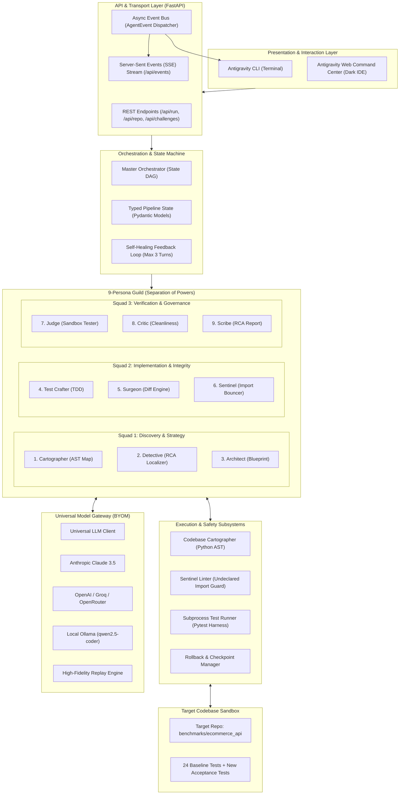
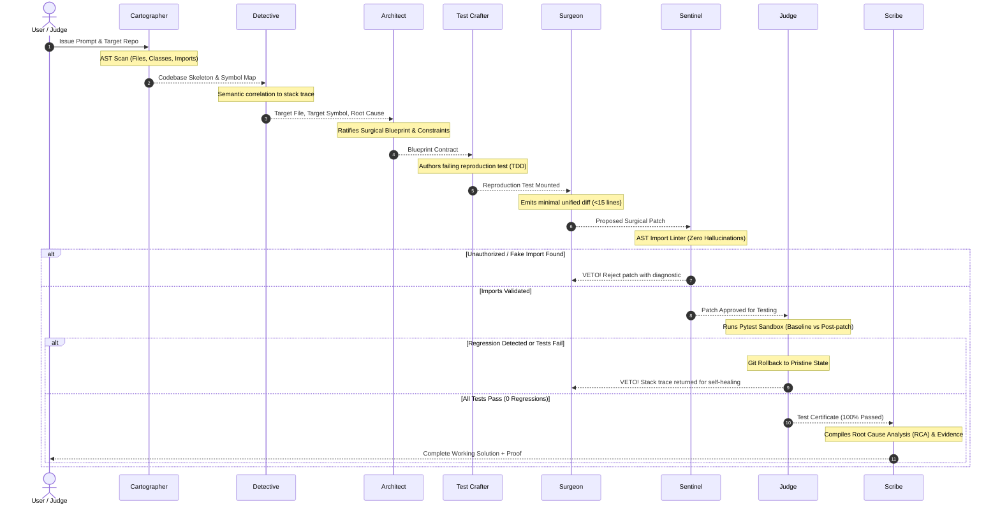

# System Architecture Document
## Project: Aether-SWE (Autonomous Software Engineering Agent)
**Classification:** Technical Architecture & System Specification  
**Document Version:** 1.0.0 · **Target Environment:** Linux / Cross-Platform  

---

## 1. High-Level Architecture Overview

Aether-SWE is engineered around a **Decoupled Multi-Persona State Machine** with strict separation of duties, a closed-loop execution sandbox, and a Universal Model Gateway.



---

## 2. The 3-Squad Persona Pipeline (State DAG)

Unlike unstructured multi-agent chats where agents loop indefinitely, Aether-SWE executes a **Deterministic Directed Acyclic Graph (DAG)** with a conditional verification feedback loop.



---

## 3. Core Architectural Subsystems

### 3.1 AST Cartography & Symbol Grounding Engine
* **File:** `backend/engine/ast_parser.py`
* **Technology:** Python Standard `ast` module (eliminates native binary compilation errors).
* **Operation:**
  1. Recursively traverses the codebase, excluding non-source directories (`.venv`, `__pycache__`, `.git`).
  2. Extracts class hierarchies, function definitions, parameters, docstrings, line numbers, and imported modules.
  3. Generates a **Token-Efficient Codebase Skeleton** (~1,500 tokens for 50 files), providing global architectural awareness without exhausting LLM context limits.

### 3.2 The Sentinel AST Hallucination Guard
* **File:** `backend/personas/craftsmen/sentinel.py` & `backend/engine/ast_parser.py`
* **Mission:** Strictly fulfills hackathon rule: *"No making up APIs or imports that don't exist."*
* **Mechanism:**
  ```python
  def verify_patch_imports(proposed_diff: str, repo_symbols: Set[str], env_modules: Set[str]) -> bool:
      patch_ast = ast.parse(proposed_diff)
      for imp in extract_imports(patch_ast):
          if imp not in env_modules and imp not in repo_symbols:
              raise HallucinatedImportError(f"Rejected unauthorized symbol: {imp}")
      return True
  ```
* Any patch introducing an unresolvable symbol is killed before reaching the test runner.

### 3.3 Zero-Regression Isolated Sandbox
* **File:** `backend/engine/sandbox.py`
* **Test Isolation:** Pytest is invoked inside an isolated subprocess with custom `PYTHONPATH` targeting the benchmark workspace.
* **Regression Algorithm:**
  1. **Phase 0 (Baseline):** Pre-execution pass records passing test set $B = \{t_1, t_2, \dots, t_n\}$.
  2. **Phase 1 (Post-Patch):** Execution pass records post-patch passing set $P = \{t_1, t_2, \dots, t_m\}$.
  3. **Regression Delta:**
     $$R = B \setminus P$$
  4. If $|R| > 0$, the Judge immediately halts progression, executes atomic rollback (`SandboxTestRunner.rollback_all()`), and re-routes the stack trace back to the Surgeon.

### 3.4 Universal "Bring Your Own Model" (BYOM) Gateway
* **File:** `backend/engine/llm_client.py`
* **Supported Protocols:**
  - **OpenAI Standard Format:** Works natively with OpenAI, OpenRouter, Groq, Together AI, vLLM, and LM Studio.
  - **Anthropic Messages Protocol:** Native Claude 3.5 Sonnet / Haiku integration.
  - **Local Ollama Protocol:** Supports local open-weights models (`qwen2.5-coder:7b`, `llama3.1`) at `http://localhost:11434/v1`.
  - **Offline High-Fidelity Simulation:** Deterministic fallback ensuring presentation reliability regardless of network conditions.

---

## 4. Data Contracts & State Management

The entire multi-persona lifecycle is governed by strictly typed Pydantic data schemas:

```
[AgentEvent]
├── id: str
├── timestamp: float
├── persona: PersonaType (Cartographer, Detective, Architect, etc.)
├── squad: SquadType (Discovery, Craftsmen, Governance)
├── event_type: EventType (THOUGHT, TOOL_CALL, TOOL_RESULT, DIFF, VERDICT)
├── title: str
├── content: str
└── metadata: Dict[str, Any]

[PipelineState]
├── repo_path: str
├── issue_description: str
├── repo_map: RepoMap (files, symbols, import_graph)
├── diagnostic: DiagnosticResult (target_file, target_symbol, line_range, root_cause)
├── blueprint: ArchitectBlueprint (plan_title, constraints, safety_boundaries)
├── repro_test: ReproductionTest (test_file, test_code, rationale)
├── surgical_patch: SurgicalPatch (file_path, diff, lines_added, lines_removed)
├── sentinel_check: SentinelCheck (is_valid, unknown_imports, violations)
├── test_result: TestRunResult (passed, total_tests, regressions, test_output)
├── critic_review: CriticReview (cleanliness_score, cyclomatic_complexity)
└── final_artifact: FinalArtifact (markdown_report, root_cause_analysis, proof)
```

---

## 5. Directory & Module Organization

```
hacknex-ai-agent/
├── backend/
│   ├── app.py                     # FastAPI Web Application & SSE Streaming Engine
│   ├── cli.py                     # Standalone Antigravity Terminal Runner
│   ├── config.py                  # System & Model Provider Configuration
│   ├── models/
│   │   └── schema.py              # Pydantic Schemas & State Contracts
│   ├── engine/
│   │   ├── orchestrator.py        # Master State Machine & Persona Coordinator
│   │   ├── ast_parser.py          # Codebase Cartographer & Import Linter
│   │   ├── sandbox.py             # Pytest Runner & Zero-Regression Detector
│   │   └── llm_client.py          # Universal BYOM Client (Claude, OpenAI, Ollama)
│   └── personas/
│       ├── base.py                # Base Persona Abstract Class
│       ├── discovery/             # Squad 1: Discovery & Strategy
│       │   ├── cartographer.py    # AST Symbol Indexer
│       │   ├── detective.py       # Root Cause & Stack Trace Localizer
│       │   └── architect.py       # Surgical Blueprint Specification
│       ├── craftsmen/             # Squad 2: Implementation & Integrity
│       │   ├── test_crafter.py    # TDD Reproduction Test Synthesizer
│       │   ├── surgeon.py         # Minimal Unified Diff Generator
│       │   └── sentinel.py        # AST Hallucination & Import Bouncer
│       └── governance/            # Squad 3: Verification & Governance
│           ├── judge.py           # Sandbox Test Arbiter & Regression Gate
│           ├── critic.py          # Code Cleanliness & Style Auditor
│           └── scribe.py          # RCA Report & Evidence Chronicler
├── frontend/
│   ├── index.html                 # Antigravity Command Center Web IDE
│   ├── css/
│   │   └── style.css              # Cyberpunk Obsidian Dark Design System
│   └── js/
│       ├── app.js                 # SSE Stream Consumer & Tab Orchestrator
│       └── diff_viewer.js         # Interactive Side-by-Side Diff Renderer
├── benchmarks/
│   └── ecommerce_api/             # Real Multi-File Benchmark Target Service
│       ├── app/                   # Source (Tokens, Permissions, Orders, Config)
│       └── tests/                 # 24 Unit Tests with 100% Baseline Pass Rate
├── docs/
│   ├── PRD.md                     # Product Requirements Document
│   └── ARCHITECTURE.md            # System Architecture Document
├── run.sh                         # 1-Click Launch Script
├── requirements.txt               # Python Dependencies
└── README.md                      # Comprehensive Hackathon Submission Documentation
```

---

## 6. Security, Isolation, and Sandboxing

1. **Subprocess Isolation:** Test execution runs in a controlled subprocess with sanitized environment variables, strictly bounded timeouts (30s), and explicit working directories.
2. **Git Checkpointing:** Files subject to modification are snapshotted in-memory before mutation; any unhandled failure or regression triggers immediate rollback to pristine state.
3. **No Arbitrary Code Execution:** The LLM does not have unconstrained shell execution privileges. Code is only executed through the structured `SandboxTestRunner` targeting `pytest`.
4. **Credential Security:** Custom API keys entered in the BYOM drawer are held in client-side memory or local browser storage and are never logged or stored insecurely.
