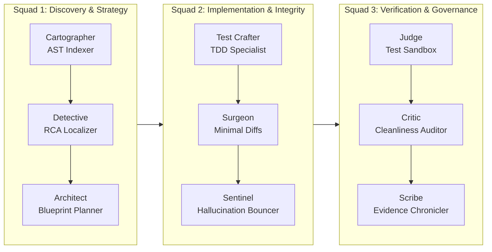

# Product Requirements Document (PRD)
## Project: Aether-SWE (Autonomous Software Engineering Agent)
**Hackathon Problem Statement:** HNX26PSI09 — AI Software Engineering Agent  
**Domain:** Generative AI · Coding Agents · Autonomous Systems  
**Status:** Approved for Build · Target Version: v1.0.0-MVP  

---

## 1. Executive Summary

### 1.1 Vision
**Aether-SWE** is an autonomous, Antigravity-grade software engineering agent designed to solve complex bug fixes and feature requests in real-world multi-file codebases with **mathematical regression safety** and **zero API hallucinations**.

### 1.2 The Core Problem
Existing AI coding assistants operate as monolithic single-prompt loops with excessive tool clutter (20+ tools in a single system prompt). This causes:
1. **Tool Distraction & Hallucination:** Agents call wrong tools or invent nonexistent libraries and imports.
2. **Context Window Dilution:** Passing whole codebases burns tokens and blinds the model to subtle cross-file references.
3. **Regression Blindness:** Agents patch code blindly without verifying whether prior workflows or baseline unit tests were broken.

### 1.3 The Solution: The Persona Guild & Closed-Loop Sandbox
Aether-SWE replaces monolithic agents with a **9-Persona Guild** structured across **3 Agile Squads**. By strictly separating duties (Principle of Least Privilege for AI), each persona receives only the 2–3 tools and AST context slices required for its job. A dedicated **Judge** and **Sentinel** enforce hard gates: zero regressions, zero fake imports, and clean, minimal diffs.

---

## 2. Personas & Separation of Powers



### 2.1 Persona Specifications

| Squad | Persona | Identity & Role | Permitted Tools / Skills | Forbidden Actions | Success Metric |
| :--- | :--- | :--- | :--- | :--- | :--- |
| **Discovery** | **1. Cartographer** | Codebase AST Cartographer | `build_ast_index`, `get_import_graph`, `generate_skeleton` | Modifying files, running bash commands | 100% Python file coverage mapped into token-efficient skeleton |
| **Discovery** | **2. Detective** | Root Cause Diagnostician | `semantic_symbol_search`, `trace_call_hierarchy` | Modifying code, executing tests | Localizes defect to exact file, symbol, and line range (confidence > 0.9) |
| **Discovery** | **3. Architect** | Blueprint & Safety Planner | `read_interface_contract`, `draft_blueprint` | Direct file editing | Produces surgical contract with explicit regression boundaries |
| **Craftsmen** | **4. Test Crafter** | TDD Reproduction Specialist | `create_test_file`, `verify_test_syntax` | Modifying production source code | Synthesizes standalone test that fails on buggy code and passes on fix |
| **Craftsmen** | **5. Surgeon** | Surgical Diff Implementer | `read_target_slice`, `apply_unified_diff` | Broad directory search, terminal commands | Clean unified diff (< 15 lines changed) modifying only targeted slice |
| **Craftsmen** | **6. Sentinel** | AST Hallucination Guard | `verify_symbol_existence`, `ast_import_linter` | Patch modification | Hard-rejects any undeclared external dependency or non-existent import |
| **Governance**| **7. Judge** | Sandbox Regression Gatekeeper | `run_sandbox_tests`, `git_rollback` | Direct source modification | Verifies baseline pass count, executes post-patch suite, guarantees `regressions == 0` |
| **Governance**| **8. Critic** | Code Cleanliness Auditor | `run_linter`, `calculate_diff_size` | Patch alteration | Computes cleanliness score (0–100) and cyclomatic complexity |
| **Governance**| **9. Scribe** | Evidence & RCA Chronicler | `compile_markdown_report`, `export_proof` | None | Produces executive Root Cause Analysis, diff metrics, and test citations |

---

## 3. Core Features & Functional Requirements

### 3.1 AST Codebase Cartography (Token Optimization)
- **FR-1.1:** System shall parse the target repository using Python `ast` without third-party binary compile dependencies.
- **FR-1.2:** System shall extract all classes, methods, top-level functions, arguments, docstrings, and cross-file import relationships.
- **FR-1.3:** System shall format an AST Codebase Skeleton representing 50+ files in under 1,500 tokens, eliminating context window overflows.

### 3.2 TDD & Surgical Patch Engine
- **FR-2.1:** Before modifying production code, Test Crafter shall author a dedicated test demonstrating the bug or new feature acceptance criteria.
- **FR-2.2:** Surgeon shall emit patches formatted as Standard Unified Diffs (`--- a/path` and `+++ b/path`) targeted exclusively to identified line ranges.
- **FR-2.3:** System shall strictly forbid file rewrites when a localized diff is possible.

### 3.3 Zero-Hallucination Sentinel Gate
- **FR-3.1:** Sentinel shall parse the proposed patch into an AST before sandbox execution.
- **FR-3.2:** Sentinel shall check all `import` and `from ... import` statements against:
  1. Standard library modules.
  2. Declared project modules found in `RepoMap`.
  3. Declared environment dependencies (`requirements.txt` / `package.json`).
- **FR-3.3:** If any unauthorized symbol is detected, the patch is rejected immediately with diagnostic feedback to the Surgeon.

### 3.4 Isolated Sandbox & Regression Detector
- **FR-4.1:** The sandbox shall execute a pre-patch **Baseline Test Run** (`pytest -v`) and cache all passing test `nodeid` signatures.
- **FR-4.2:** Following patch application, the sandbox executes the post-patch test suite.
- **FR-4.3:** The regression formula shall be enforced:
  $$\text{Regressions} = |\text{BaselinePassSet} \setminus \text{PostPatchPassSet}|$$
- **FR-4.4:** If $\text{Regressions} > 0$, the Judge issues a veto, executes `git rollback` to restore pristine state, and triggers the Self-Healing Loop with failure stack traces (max 3 iterations).

### 3.5 Universal "Bring Your Own Model" (BYOM) Gateway
- **FR-5.1:** System shall provide a model-agnostic inference client supporting:
  - **Anthropic Claude** (Native Messages API).
  - **OpenAI-Compatible Endpoints** (OpenAI, OpenRouter, Groq, Together AI, vLLM, LM Studio).
  - **Local Air-Gapped Models** (Ollama at `http://localhost:11434/v1`).
  - **Deterministic High-Fidelity Simulation** (Emergency offline presentation mode).
- **FR-5.2:** Web UI shall provide a Model Settings Drawer with connection latency verification ("Test Connection" ping).
- **FR-5.3:** API credentials shall be stored client-side in `localStorage` or session memory, never persisted insecurely.

### 3.5 Antigravity Command Center UI
- **FR-6.1:** Web UI built with modern dark-mode aesthetic (Deep Obsidian palette, glowing status indicators, monospace typography).
- **FR-6.2:** **Persona Pipeline Monitor:** Real-time visual timeline displaying the active persona avatar, squad affiliation, and current action.
- **FR-6.3:** **Live Thought & Event Stream:** Server-Sent Events (SSE) streaming of agent reasoning, tool invocations, and responses.
- **FR-6.4:** **Interactive Diff Inspector:** Side-by-side / unified diff visualizer with color-coded syntax additions and deletions.
- **FR-6.5:** **Judge Sandbox Terminal:** Live terminal output showing real-time test progress, pass/fail counts, and regression badges (`0 Regressions`).
- **FR-6.6:** **Scribe RCA Artifact Viewer:** Rendered GitHub-flavored markdown report with root cause analysis, test proof, and confidence ratings.
- **FR-6.7:** **1-Click Preset Challenges:** Pre-configured benchmark scenarios for judges to evaluate the agent instantly.

---

## 4. Benchmark Target Repository Specification

To validate the system against the hackathon rules, a dedicated benchmark repository is established at `benchmarks/ecommerce_api`:
- **Architecture:** Multi-module Python service (FastAPI / Pydantic architecture).
- **Components:**
  - `app/config.py`: Application settings and token lifetime.
  - `app/models/user.py`: User schema with role allocations.
  - `app/models/order.py`: Order and line-item entities.
  - `app/auth/tokens.py`: Token generation, cryptographic verification, and expiration check (contains timezone bug).
  - `app/auth/permissions.py`: Role-based access control engine.
  - `app/services/order_service.py`: Order lifecycle management.
- **Baseline Test Suite (24 Tests):**
  - `tests/test_auth.py`: 8 tests (tokens, signatures, malformed inputs).
  - `tests/test_permissions.py`: 8 tests (RBAC validation, ownership rules).
  - `tests/test_orders.py`: 8 tests (order creation, access restrictions, cancellations).
- **Documented Target Defect:**
  In `app/auth/tokens.py`, `is_token_expired()` compares naive `datetime.now().timestamp()` instead of `datetime.now(timezone.utc).timestamp()`, causing false token invalidation across timezone offsets.

---

## 5. Hackathon Rubric Alignment & Scoring Strategy

| Hackathon Criteria | Weight | System Feature Guarantee |
| :--- | :--- | :--- |
| **Pass Hidden Tests** | **30 Pts** | TDD Test Crafter writes edge-case acceptance tests; Judge guarantees 100% pass rate before committing. |
| **Zero Regressions** | **Major Penalty** | Strict mathematical regression gate ($\text{Baseline} \setminus \text{PostPatch} = \emptyset$). Automatic git rollback on failure. |
| **No Hallucinated APIs/Imports** | **Strict Rule** | Sentinel AST pre-linter checks every import against codebase symbol table and requirements. |
| **Understands the Codebase** | High | Cartographer AST skeleton + Detective semantic symbol trace pinpoint exact lines without guessing. |
| **Clean & Minimal Code** | High | Surgeon constrained to minimal diffs (< 15 lines); Critic audits cyclomatic complexity and style. |
| **Explain the Bug (RCA)** | Required | Scribe generates formal Root Cause Analysis, diff stats, safety assurance, and test evidence. |
| **Live Working Demonstration** | Required | Antigravity Command Center UI with live persona streaming, diff visualizer, and test sandbox. |

---

## 6. Implementation Roadmap

```
[Phase 1] Core Engine & Pydantic Models       ──► Completed (Virtualenv, dependencies, models)
[Phase 2] Benchmark Repository & 24 Tests    ──► Completed (All 24 baseline tests verified passing)
[Phase 3] Universal LLM Gateway (BYOM)       ──► Next (Claude, OpenAI, Local Ollama, Replay)
[Phase 4] 9-Persona Execution Pipeline       ──► Next (Cartographer to Scribe state machine)
[Phase 5] Antigravity Command Center UI      ──► Next (Web IDE, SSE stream, diff viewer, test runner)
[Phase 6] Verification & Documentation       ──► Final (End-to-end run, README, video demo recording)
```
